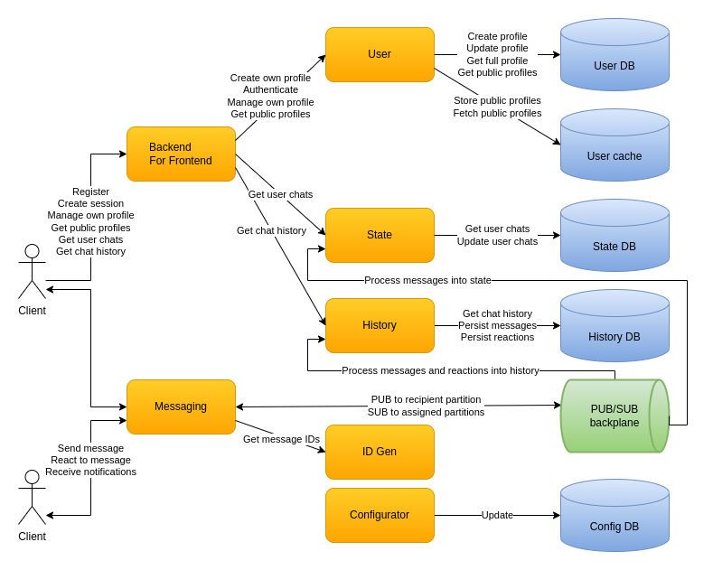

# CecoChat

System design and implementation of a chat for millions active users based on Kafka, Cassandra, Redis, gRPC, Docker, ASP.NET, .NET 5.

# Why

I decided to take on the challenge to design a globally-scalable chat like WhatsApp and Facebook Messenger. Based on [statistics](https://www.statista.com/statistics/258749/most-popular-global-mobile-messenger-apps/) the montly active users are 2.0 bln for WhatsApp and 1.3 bln for Facebook Messenger. At that scale I decided to start a bit smaller. A good first step was to design a system that would be able to handle a smaller number of active users which are directly connected to it. I call it a cell. After that I would need to design how multiple cells placed in different geographic locations would communicate with each other. I certainly don't have the infrastructure to validate the design and the implementation. But I used the challenge to think at a large scale and to learn a few new technologies and approaches along the way.

# Design

## Back of the envelope calculations

The `docs` folder contains the detailed calculations. A messaging server is the server to which users directly connect to. A key limit I impose is `50K connections per messaging server`. A simple calculation tells that `2K messaging servers` are needed in order to support `100 mln active users`.

Throughput-wise a limit of `256 bytes per message` with `640 mln users` spread throughout the day each of which sends `64 messages per day` gives us `116 MB/s for the cell` or `0.06 MB/s per messaging server`.

Calculating a peak usage for `1 hour` daily where 80% of the maximum users - `80 mln active users` send 50% of their daily messages - `32 messages` we get `174 MB/s for the cell` or `0.09 MB/s per messaging server`.

These numbers do not take into account the security and transport data overhead. Numbers are not small when we look at the cell as a whole. But for a single messaging server the throughput is tiny. Note that this traffic would be multiplied. For example sending a message would require that data to be passed between different layers, possibly to multiple recipients and stored multiple times.

## Overall design

The clients which could use various front-end technologies connect to messaging servers in order to chat. Messaging servers communicate with each other indirectly using a PUBSUB backplane. The PUBSUB backplane also acts like an event log. Materialize servers transform messages from the event log into a history database. The history is available for querying by the clients via history servers. Clients obtain the addresses for the messaging and history server from a connect server. The messaging, history, connect servers use dynamic configuration which is updated centrally. All of this is powered by a deployment infrastructure which takes care of failover, growth and shrinking of the different servers based on the load.

All the diagrams are in the `docs` folder and you need [draw.io](https://app.diagrams.net/) in order to view them. From the `Help` item in the menu you can get a desktop tool. Currently this is the [link with the releases](https://github.com/jgraph/drawio-desktop/releases).

## Technologies

* Clients use HTTP when they need to find out where to connect. After that gRPC is utilized in order to obtain history and exchange messages. gRPC is language-agnostic, which is important for the variety of front-end technologies. It is lightweight and performant. It is based on HTTP/2 which allows for both inter-operability and optimizations from the protocol. gRPC uses full-duplex communication. Unfortunately support for some of the languages isn't perfect and things like error handling could be improved.

* PUBSUB backplane uses Kafka. It is a scalable message broker enabling superb throughput due to its balanced distribution of topic-partition leadership throughout the cluster. It is fault-tolerant and persists messages. Kafka allows different consumer groups each of which can process messages independently from each other. The pull model allows consumers to process messages at their own rate. Kafka can be tuned for either low latency, high-throughput or something in-between. It is a good solution for an event log, especially when processing a single message is fast.

* History database uses Cassandra. It is suitable for small fast writes and range queries both of which are good for our use-case. Cassandra has built-in partitioning and supports multi data-center replication. It allows precise control over the consistency used for writes and reads.

* Configuration database uses Redis. It is fast and easy to use. Redis supports PUBSUB used for notifying subscribers about configuration changes.

* Docker is used for a containerization technology mainly because of its maturity and popularity.

* Most of the servers use ASP.NET and .NET 5. Even though they could be implemented as a background services/daemons ASP.NET allows easy support for health checks and monitoring based on HTTP. The Kestrel server is performant and has integration with gRPC. In general .NET is a very mature, widely-used, feature-rich and well supported development platform.
