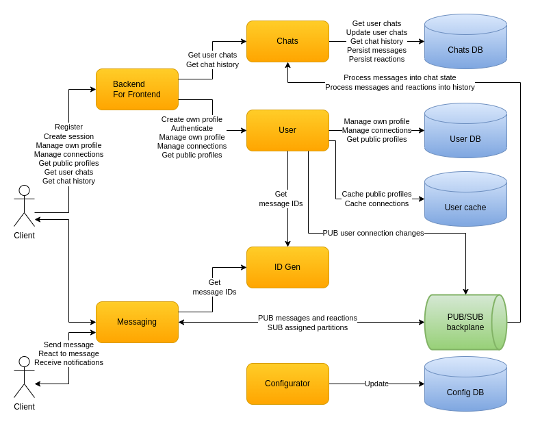

Chat for millions of users with [limited-for-now capabilities](docs/intro-main.md).

[System design](docs/intro-design.md) and [partial implementation](source/) based on Kafka, Cassandra, HTTP, gRPC, Redis, .NET 6, ASP.NET. [Configurable](docs/design-configuration.md) and [observable](docs/design-observability.md) environment based on OpenTelemetry, Jaeger, Prometheus, Grafana, ElasticSearch, Fluentd, Kibana. Containerized components based on Docker which can be [ran locally](docs/infrastructure-main.md#Run-locally).

I appreciate all comments so feel free to use the `Discussions` tab.

# Code

# Technologies

### Integration

### Data

### Internal implementation

### Observability

### Deployment

# Documentation

* Intro
  - [Capabilities](docs/intro-capabilities.md)
  - [Overall design](docs/intro-design.md)
  - [Technologies](docs/intro-technologies.md)
* Research
  - [Concurrent connections limit](docs/research-connection-limit.md)
  - [Calculations](docs/research-calculations.md)
  - [Main problems](docs/research-main-problems.md)
* Design
  - [Messaging](docs/design-messaging.md)
  - [User chats, chat history](docs/design-state-history.md)
  - [Clients](docs/design-clients.md)
  - [Configuration](docs/design-configuration.md)
  - [Observability](docs/design-observability.md)
  - [Deployment](docs/design-deployment.md)
* Infrastructure
  - [CI pipeline](docs/infrastructure-main.md#CI-pipeline)
  - [Run locally](docs/infrastructure-main.md#Run-locally)
* [What next](docs/what-next.md)

# Design

