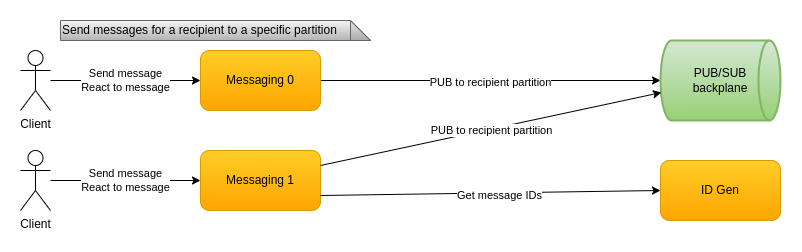
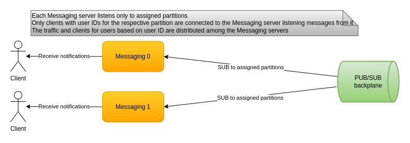

# CecoChat

System design and partial implementation of a chat for 10-100 millions active users based on Kafka, Cassandra, gRPC, Redis, Docker, ASP.NET, .NET 5.

I would appreciate any comments so feel free to use the `Discussions` tab on the Git repo.

P.S. The solution is named after my short name.

# Introduction

## Why

<details>
<summary>Show/hide</summary>

I decided to take on the challenge to design a globally-scalable chat like WhatsApp and Facebook Messenger. Based on [statistics](https://www.statista.com/statistics/258749/most-popular-global-mobile-messenger-apps/) the montly active users are 2.0 bln for WhatsApp and 1.3 bln for Facebook Messenger. At that scale I decided to start a bit smaller. A good first step was to design a system that would be able to handle a smaller number of active users which are directly connected to it. Let's call it a cell. After that I would need to design how multiple cells placed in different geographic locations would communicate with each other. I certainly don't have the infrastructure to validate the design and the implementation. But I used the challenge to think at a large scale and to learn a few new technologies and approaches along the way.

</details>

## Capabilities

<details>
<summary>Show/hide</summary>

### Functional

* User can send messages to and receive messages from other users
* User is shown at log-in the missed messages while being offline
* User can review chat history between him and another user
* Same user can use multiple clients

Currently no user profile and friendship are implemented so clients rely on user IDs.

### Non-functional

* Designed for 10-100 mln of active users
  - Expensive to validate for real
  - Numbers from the calculation show that the solution is possible
  - The concurrent connection benchmark is promising
* A balanced aproach between latency, consistency and fault tolerance

</details>

## Concurrent connections benchmark

<details>
<summary>Show/hide</summary>

I decided to benchmark the number of connections per messaging server. The code is in the [check](check/) folder. I used two machines connected via 100Mbps router. Details are as follow:

| Machine     | CPU         | Frequency | Cores | RAM  | OS                      |
| :---------- | :---------  | :-------- | :---- | :--- | :---------------------- |
| Weaker      | Core 2 Duo  | 2133MHz   | 2     | 4GB  | Ubuntu Server 20.04 LTS |
| Moderate    | QuadCore i5 | 3533MHz   | 4     | 16GB | Windows 10 20H2         |

On the server I am using ASP.NET Core gRPC services utilizing async-await and TPL. The clients connect first and then simultaneously start sending 20 messages at a rate of 1 per second again utilizing async-await and TPL. Below are the results specifying which machine ran the client and what are the server process resources allocated.

| Client machine | Clients succeeded | Client time | Server machine | Server CPU | Server threads | Server RAM |
| :------------- | :---------------- | :---------- | :------------- | :--------- | :------------- | :--------- |
| Moderate       | 15869             | 21 seconds  | Weaker         | 150%-200%  | ?              | 1.3GB      |
| Weaker         | 28232             | 147 seconds | Moderate       | 5-10%      | 67             | 3.55GB     |

The clients succeeded on both machines are a result of port exhaustion limits hit on both OS-es. The Windows error was `An operation on a socket could not be performed because the system lacked sufficient buffer space or because a queue was full` and the Ubuntu Server one: `Cannot assign requested address`. Additionally when clients were on the weaker machine the client time required in order to complete the requests is considerably higher while it was obvious that the server was not under serious load. One of these could be the issue: Windows 10 has some limits which prohibit it from handling a high number of concurrent clients, the weaker machine is really weak, there is a concurrency issue with .NET 5 at least on Ubuntu Server, I've messed something in the client or server code.

Based on these numbers I think that 50k concurrent connections shouldn't be an issue and would be a useful limit in our calculations.

</details>

## Back of the envelope calculations

<details>
<summary>Show/hide</summary>

The [back-of-the-envelope](docs/back-of-the-envelope.md) file contains the detailed calculations. A messaging server is the server to which users directly connect to. A key limit is `50K connections per messaging server`. A simple calculation tells that `2K messaging servers` are needed in order to support `100 mln active users`.

Throughput-wise a limit of `256 bytes per message` with `640 mln users` spread throughout the day each of which sends `64 messages per day` gives us `116 MB/s for the cell` or `0.06 MB/s per messaging server`.

Calculating a peak usage for `1 hour` daily where 80% of the maximum users - `80 mln active users` send 50% of their daily messages - `32 messages` we get `174 MB/s for the cell` or `0.09 MB/s per messaging server`.

These numbers do not take into account the security and transport data overhead. Numbers are not small when we look at the cell as a whole. But for a single messaging server the throughput is tiny. Note that this traffic would be multiplied. For example sending a message would require that data to be passed between different layers, possibly to multiple recipients and stored multiple times in order to enable faster querying.

</details>

## Overall design


<details>
<summary>Show/hide</summary>

Clients connect to messaging servers in order to chat. Messaging servers communicate with each other indirectly using a PUB/SUB backplane. The PUB/SUB backplane also acts like an event log. Materialize servers transform messages from the event log into a history database which is the source of truth. The history is available for querying by the clients via history servers. Clients obtain the addresses for the messaging and history server from a connect server. The messaging, history, connect servers use dynamic configuration which is updated centrally. All of this is powered by a deployment infrastructure which takes care of failover, growth and shrinking of the different server sets based on load.

All the diagrams are in the [docs](docs/) folder and [draw.io](https://app.diagrams.net/) is needed in order to view them. From the `Help` item in the menu a desktop tool could be downloaded, if preferred. Currently this is the [link with the releases](https://github.com/jgraph/drawio-desktop/releases).

</details>

## Technologies

<details>
<summary>Show/hide</summary>

* Clients use HTTP when they need to find out where to connect. After that gRPC is utilized in order to obtain history and exchange messages. gRPC is language-agnostic, which is important for the variety of front-end technologies. It is lightweight and has a decent performance. It is based on HTTP/2 which allows for both inter-operability and optimizations from the protocol. gRPC uses full-duplex communication. Unfortunately support for some of the languages isn't perfect and things like error handling could be improved.

* PUB/SUB backplane uses Kafka. It is a scalable message broker enabling superb throughput due to its balanced distribution of topic-partition leadership throughout the cluster. It is fault-tolerant and persists messages. Kafka allows different consumer groups each of which can process messages independently from each other. The pull model allows consumers to process messages at their own rate. Kafka can be tuned for either low latency, high-throughput or something in-between. It is a good solution for an event log, especially when processing a single message is fast.

* History database uses Cassandra. It is suitable for small fast writes and range queries both of which are good for our use-case. Cassandra has built-in partitioning and supports multi data-center replication. It allows precise control over the consistency used for writes and reads.

* Configuration database uses Redis. It is fast and easy to use. Redis supports PUB/SUB used for notifying subscribers about configuration changes.

* Docker is used for a containerization technology mainly because of its maturity and popularity.

* Most of the servers use ASP.NET and .NET 5. Even though they could be implemented as a background services/daemons ASP.NET allows easy support for health checks and monitoring based on HTTP. The Kestrel server is performant and has integration with gRPC. In general .NET is a very mature, widely-used, feature-rich and well supported development platform.

</details>

# Design

## Send and receive messages

We have a limit of how many clients can connect to a messaging server. A key design element is how to distribute the messages between the messaging servers. Which is what two clients connected to different messaging servers would need in order to exchange messages.

### Standard approach

<details>
<summary>Show/hide</summary>

The standard approach which I observed a few times when I researched this problem was for the messaging servers to communicate directly.

The benefits of this approach are:

* Lower latency because of the direct communication.
* Standard load-balancing when a user connects initially to a single messaging server.
* Messaging servers are stateless.

Drawbacks are not small:

* Each messaging server needs to know which other messaging server the recepient of the message is connected to
  - One option is each messaging server to keep an in-memory data structure for the up to 100 mln clients which isn't something easy to implement, especially if we take into account the fact that this data structure needs to be thread-safe. A hashtable, b-trees or some variant of trie are possible options.
  - Another option is to offload the storage of this knowledge to a configuration database cluster. This would increase the latency of course.
* Messaging servers need to keep open connections between each other. This does not play well with one of the key limits in the system which is the number of connections to a messaging server.
* Messaging servers need to know when one of them fails and re-establish the connection to its replacement.
* Consistency of the data would be harder since the two logical operations required for message processing would be separate instead of a single one.
  - Sending the message to its recipient(s) by calling one (or multiple for group chats) messaging servers
  - Persisting the message into the history database

</details>

### Alternative approach

<details>
<summary>Show/hide</summary>

I decided to explore a different approach for dealing with the drawbacks from the standard one. It is to rely on a PUB/SUB backplane resulting in indirect communication between messaging servers. The PUB/SUB backplane also acts like an event log.

The benefits are:

* Messaging server needs to know only the topic (or in the case of Kafka - the topic partition) for the recipient, which is something easily calculated locally. It still needs to keep connections to the Kafka cluster nodes but they are smaller in number.
* Messaging servers do not need to know about and keep connection between each other.
* Consistency problem is partially solved since message processing when a message is received is a single action - placing the message in the PUB/SUB backplane. Of course this implies using a PUB/SUB technology like Kafka which allows different consumer groups which process messages independently from each other. And at the very best what we have is eventual consistency.

The drawbacks, just like the benefits, are the opposite from the previous approach

* Higher latency because of the indirect communication, especially if we persist the message in Kafka to not just the leader but to at least 1 more in-sync replica.
* Client load-balancing becomes non-trivial, since balanced distribution of topic partitions between all messaging servers now is crucial. Manually assigning topic partitions in Kafka is considered a custom approach, compared to the built-in auto-balancing.
* The messaging servers become stateful since they are now bound to 2 things.
  - Each messaging server needs to listen to a specific set of topic partitions. This can be solved via centraized configuration.
  - Each messaging server is the only one responsible to the set of clients which use the mentioned topic partitions. To solve this issue the deployment infrastructure can keep idle messaging servers ready to replace ones declared dead.

</details>

I decided to try out the alternative approach using a PUB/SUB backplane.

### Send

<details>
<summary>Show/hide</summary>



Sending messages relies on a formula in order to calculate which topic partition the recipient is assigned to.

```
Recipient Kafka partition = Hash(Recipient ID) % Partition count
```

Typically Kafka uses auto-partitioning when sending messages, so doing it manually is not the standard way. But in our case it is required since each messaging server consumer is stateful - the clients connected to it are assigned to specific partitions. Fortunately the Kafka .NET client API has these capabilities.

The hash function needs to be stable because it would be run on multiple different servers. It needs to provide an excellent distribution since we don't want hot partitions. And since this is the same function which is used to decide which messaging server each client connects to - we don't want to hit our messaging server connection number limit. The performance requirements are not key, it just doesn't need to be slow. I used [FNV](https://en.wikipedia.org/wiki/Fowler%E2%80%93Noll%E2%80%93Vo_hash_function) which satisfied the requirements. I [checked](check/) how it behaves and its total distribution deviation and max one are small enough.

</details>

### Receive

<details>
<summary>Show/hide</summary>



Each messaging server is stateful. It contains a Kafka consumer which has manually assigned Kafka partitions and consumes messages only from them. Additionally only clients whose user ID is assigned to one of those same partitions connect to that messaging server.

</details>

## History

<details>
<summary>Show/hide</summary>

Materialize servers use a standard Kafka consumer group with automatic partition assignment and balancing. Their role is to create the history data in the Cassandra database. Currently 2 types of queries are supported which reflects the data that is being entered.

* `Get user history` - returns a predefined max number of messages sent to the user with the specified user ID which are older than a specified date. In order to support this query for both sender and receiver the message is entered in the database twice. The table has a `user ID` column which is the partition key. It is separate from the `sender ID` and `receiver ID`.
* `Get dialog history` - returns a predefined max number of messages between 2 users with the specified user IDs which are older than a specified date. The partition key here is a string of `userID1-userID2`. To avoid ambiguity `userID1` is always the smaller.

</details>

## Clients

<details>
<summary>Show/hide</summary>


Because of the messaging servers state each client needs to be connected to the correct messaging server. This problem could be solved via a load balancer which extracts the user ID from the client's access token. This is an operation which would require an additional decryption and application load-balancing for every message. I decided to approach things in a different way. The connect server finds out which the messaging server is only once and the clients use that address to connect directly to their messaging server. There are operational issues with this approach but the additional application load-balancing and decryption is avoided. To make things consistent the connect server returns the history server address as well, but here it could be the HTTP load-balancer address.

A client's way of being consistent with the latest messages is to start listening for new ones from the messaging server first. After than the client can query for the user history using the current date until it decides it has caught up by checking the date of the oldest returned message. Additionally, each client can explore a dialog with a certain user in the same manner using the second query supported by the history database. In order to handle duplicate messages which could be already present in the client's local database each message has a unique ID used for deduplication.

</details>

## Configuration

<details>
<summary>Show/hide</summary>


The configuration database stores information related to server partition assignment. Each messaging server is assigned a server ID. The configuration database stores the address and partitions for each server ID. It is used by:

* Connect server to:
  - Get the user partition by the user ID
  - Get the server address for that partition
* Messaging server to:
  - Assign the partitions to the Kafka consumer in order to consume messages

Redis conveniently supports simple keys for plain data such as partition count and history settings. Redis hashes (which could probably be called maps) are used to store key-value pairs like the (server ID -> partitions) and (server ID -> address). After the configurator server applies configuration changes the Redis PUB/SUB is used to publish a notification to subscribers using the respective channels. Each interested server listens to changes for:

* Connect server - partition count, server partitions, server addresses
* Messaging server - partition count, server partitions
* History server - history settings

</details>

## Failover

<details>
<summary>Show/hide</summary>


Each Kafka partition is consumed by exactly one messaging server. Once this server is declared dead it should be replaced by a new one. To speed things up the deployment infrastructure should keep idle messaging servers waiting. Idle ones also have server IDs as described in the configuration section. Replacing a dead server then costs:

* Handling the notification from the deployment infrastructure
* Updating the server partitions configuration
* Publishing the configuration change notification

</details>

# How to run

<details>
<summary>Show/hide</summary>

Despite there is quite a bit of code written a good part of it is a proof-of-concept. In order to validate the implementation a lot of physical infrastructure is required which is quite expensive unfortunately. Despite that the system is functioning and with a machine powerful enough everything could be powered up locally. I've used `docker-compose` in order to run the required servers and the solution itself since it is also containerized. I've limited the memory for most of the containers to `512 MB`.

## Run infrastructure

Before and after running the containers there are some [scripts for preparing](run/prepare/) the servers. Most of them simply create the `docker` volumes. The `docker-compose` files for the containers are in the [run folder](run/).

* Kafka has 4 containers:
  - 2 Kafka brokers
  - Zookeeper
  - Kafdrop web interface
* Cassandra has 4 containers:
  - 3 Cassandra instances
  - Cassandra web interface
* Redis has 2 containers:
  - 1 Redis instance
  - Redis commander

## Containerize and run CecoChat

In order to containerize CecoChat you need to build it using .NET 5. I've used Visual Studio since I am also developing it, but the SDK is enough to simply build it. The [containerize](containerize/) folder contains the Docker files and scripts for building the images. Internally the scripts do `dotnet publish` and use `Debug` configuration with `Trace`/`Verbose` level of logging but it can be changed as prefered. The `docker-compose` file creates containers for:

* 1 connect server
* 2 messaging servers
* 1 materialize server
* 1 history server

TODO: Add Redis scripts to create the initial state which is currently hardcoded but can be entered by watching the server logs which report all keys.

## Clients

I've written a very basic console client. There is also a WPF desktop client for Windows which has some decent UI. A browser client would be ideal though.

</details>

# What next

<details>
<summary>Show/hide</summary>

* The architecturally most important thing is to design the communication between cells which is also the most challenging
* Add missing operability elements
  - Tracing
  - Monitoring
  - Health status
  - Deployment
* Internal things could be worked on
  - Generate message IDs on the server
  - Benchmark messaging server connection limit
  - Configure better and benchmark Kafka
  - Revisit Cassandra design and consider client usage to employ bulk-loading data
* Add different types of messages:
  - Group messages
  - Media messages - image/video
  - Status update messages: online, offline, away, busy etc.
  - Acks:
    - CecoChat has received the message
    - Recipient has received the message
    - Recipient has seen the message
* Add user and profile related features
  - User authentication and authorization
  - Store user profile data
  - Handle friendship between users

</details>
