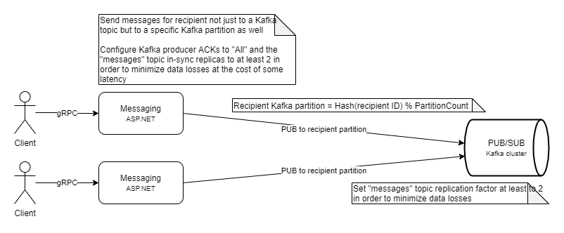
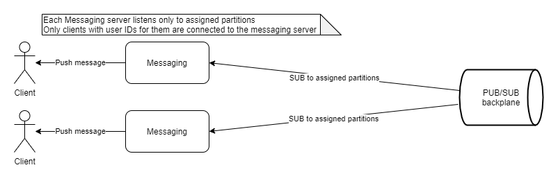

# Send



Sending messages relies on a formula in order to calculate which topic partition the recipient is assigned to.

```
Recipient Kafka partition = Hash(Recipient ID) % Partition count
```

Typically Kafka uses auto-partitioning when sending messages, so doing it manually is not the standard way. But in our case it is required since each messaging server consumer is stateful - the clients connected to it are assigned to specific partitions. Fortunately the Kafka .NET client API has these capabilities.

The hash function needs to be stable because it would be run on multiple different servers. It needs to provide an excellent distribution since we don't want hot partitions. And since this is the same function which is used to decide which messaging server each client connects to - we don't want to hit our messaging server connection number limit. The performance requirements are not key, it just doesn't need to be slow. I used [FNV](https://en.wikipedia.org/wiki/Fowler%E2%80%93Noll%E2%80%93Vo_hash_function) which satisfied the requirements. I [checked](check/) how it behaves and its total distribution deviation and max one are small enough.

# Receive



Each messaging server is stateful. It contains a Kafka consumer which has manually assigned Kafka partitions and consumes messages only from them. Additionally only clients whose user ID is assigned to one of those same partitions connect to that messaging server.

# Sender with multiple clients

Sometimes a user has multiple clients with the same user ID. Each client should be able to receive messages sent from one of the other clients. There are two ways to achieve this:

* Since all clients are connected to the same messaging server, simply send the message to the other clients. This has pros and cons:
  - Low latency
  - No additional transfer of data between messaging servers and PUB/SUB backplane
  - Violation of the alternative approach taken earlier since now each send has two operations which may lead to inconsistency:
    - Sending the message to the receiver using its topic-partition
    - Sending the message to the other clients connected to the same messaging server
* In order to preserve the earlier decision to follow the alternative approach, each messaging server has a separate Kafka consumer group for duplicating messages to other clients with the same user ID. This second consumer group simply reads the message, changes the recipient ID from receiver ID to sender ID and sends it back to the appropriate topic partition. This has the following pros and cons:
  - Higher latency - now the message for the other clients with the same user ID goes additionally through
    - Receiver messaging server
    - Sender messaging server
  - Additional transfer of data between messaging servers and PUB/SUB backplane
  - Alignment with the alternative approach decision - each send has only one operation which guarantees consistency
