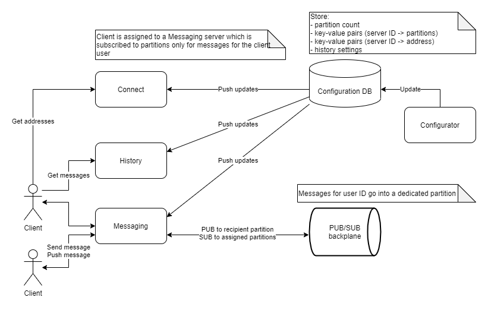
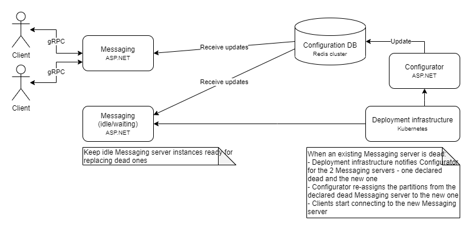

# Configuration

The configuration database stores information related to server partition assignment. Each messaging server is assigned a server ID. The configuration database stores the address and partitions for each server ID. It is used by:

* Connect server to:
  - Get the user partition by the user ID
  - Get the server address for that partition
* Messaging server to:
  - Assign the partitions to the Kafka consumer in order to consume messages

Redis conveniently supports simple keys for plain data such as partition count and history settings. Redis hashes (which could probably be called maps) are used to store key-value pairs like the (server ID -> partitions) and (server ID -> address). After the configurator server applies configuration changes the Redis PUB/SUB is used to publish a notification to subscribers using the respective channels. Each interested server listens to changes for:

* Connect server - partition count, server partitions, server addresses
* Messaging server - partition count, server partitions
* History server - history settings

# Failover

Each Kafka partition is consumed by exactly one messaging server. Once this server is declared dead it should be replaced by a new one. To speed things up the deployment infrastructure should keep idle messaging servers waiting. Idle ones also have server IDs as described in the configuration section. Replacing a dead server then costs:

* Handling the notification from the deployment infrastructure
* Updating the server partitions configuration
* Publishing the configuration change notification
