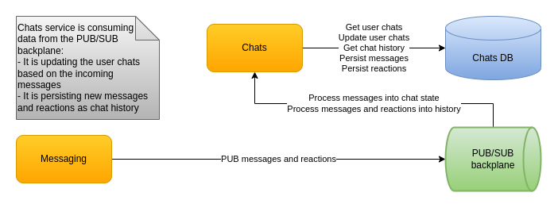

# Chats design

# User chats

User chats has the following requirements:

* Partitioning of user chats based on user ID.
* Fast small writes for the currently active users and the chats they are using. That would happen as the data is materialized from the PUB/SUB backplane.
* Fast query for user chats when a user logs-in.

The user chat state holds the newest message ID, which is timestamped since it is a Snowflake. This way users know if they have a new message for a particular chat. Messages for a given chat come from the PUB/SUB backplane from different Kafka partitions and thus are not guaranteed to be time ordered. So when we update a user chat newest message ID we need to check if it is actually newer. Unfortunately Cassandra doesn't support updating a record via a WHERE clause for columns other than PARTITIONING KEY and CLUSTERING KEY since it does not perform a read before doing a write. One Cassandra-based way to work around this is via lightweight transactions which contact all replicas for the given keyspace. This increases latency and slows down the processing of messages from the PUB/SUB backplane. As a solution we simply load the chat, determine if it needs an update and update if necessary. 2 round trips for a low latency database is acceptable. The operation doesn't suffer from concurrency issues since the Kafka subscribers process each partition in a single thread and messages for each user go into the same partition. Another way to do this is to keep an in-memory cache in order to avoid loading the chat each time. Unfortunately that could make the cache ineffective since the service is stateless. If we make it stateful, that would increase the complexity of the routing and deployment.

# Chat history

Chat history has the following requirements:

* Partitioning of chat messages based on chat ID.
* Fast small writes in the most recent part of messages. That would happen as the data is materialized from the PUB/SUB backplane.
* Recent and random range queries of messages for the following use cases:
  - When a user opens a chat
  - When a user reviews a chat back in time
