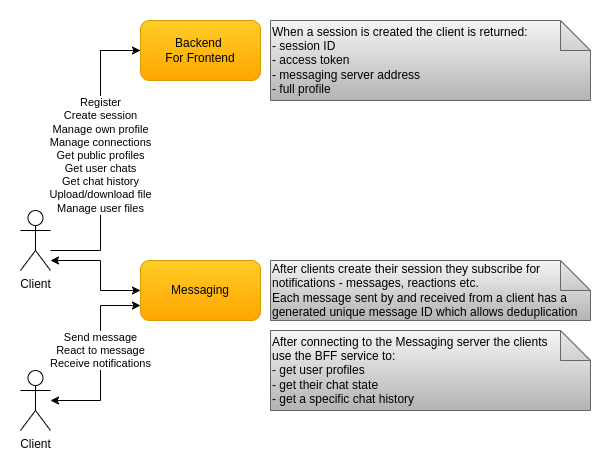

# Clients

Clients use the BFF for the following operations:
* Register a new account by providing credentials and profile data.
* Create a new session which returns a session ID, access token, full profile, messaging server address based on the supplied credentials.
* Manage their own profile including changing password, editing trivial profile data.
* Search users by name, for example all profiles with user name containing `mar`.
* Manage their connections - invite, accept, cancel, remove.
* Upload new and download existing files.
* Get the full list of their files or the files newer than a specified timestamp.
* Get user chats returns all the chats for a user which have a message newer than a specified timestamp.
* Get chat messages returns all messages and reactions to them for a given chat which are older than a specified timestamp.

Because of the messaging service instances state each client needs to be connected to the correct messaging service instance. This problem could be solved via a load balancer which extracts the user ID from the client's access token. This is an operation which would require an additional decryption and application load-balancing for every message. Instead, the BFF service is used to find out which the correct messaging service instance is. This happens only once and the clients use that address to connect directly to their messaging service instance. There are operational issues with this approach but the additional application load-balancing and decryption is avoided.

A client's way of being consistent with the latest messages is:
* Start listening for new messages from the messaging service first.
* Query the chats for its user.
* Query the messages for a given chat.

In order to handle duplicate messages which could be already present in the client's local database each message has a unique ID used for deduplication.
