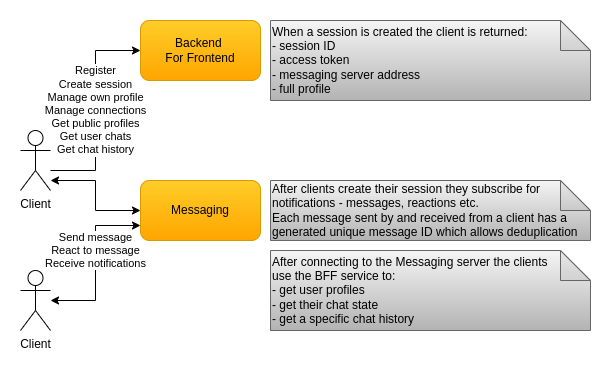

# Clients

Because of the messaging servers state each client needs to be connected to the correct messaging server. This problem could be solved via a load balancer which extracts the user ID from the client's access token. This is an operation which would require an additional decryption and application load-balancing for every message. Instead the connect server is used to find out which the messaging server is. This happens only once and the clients use that address to connect directly to their messaging server. There are operational issues with this approach but the additional application load-balancing and decryption is avoided.

A client's way of being consistent with the latest messages is to start listening for new ones from the messaging server first. After than the client can query the history service using the current date until it decides it has caught up by checking the date of the oldest returned message. Additionally, each client can explore a dialog with a certain user in the same manner using the second query supported by the history database. In order to handle duplicate messages which could be already present in the client's local database each message has a unique ID used for deduplication.
