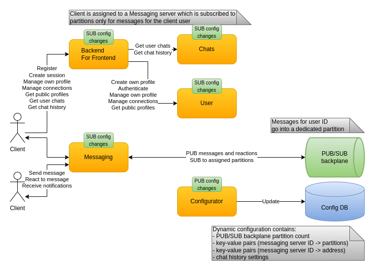

# Configuration

## Types

### Static

Static app configuration is stored in `appsettings.json` files as is typical for .NET applications. For some services it is overriden for the `Development` environment via the `appsettings.ENVIRONMENT.json` approach. The [CecoChat docker-compose files](../deploy/docker) uses environment variables with specific prefixes in order to push static configuration values to the services at start-up. [ASP.NET documentation](https://docs.microsoft.com/en-us/aspnet/core/fundamentals/configuration/?view=aspnetcore-5.0#environment-variables) describes how to name the environment variables in order to override both ASP.NET and app-specific values.

### Dynamic

Some parts of the configuration are designed to be changed while it is running. These parts are stored in Redis and read at start-up. The [prepare script](../deploy/docker/redis/data.sh) inputs the partitioning and chat history configuration values which need to be present and valid at all times. The configuration can be changed manually using the `redis-cli` command after attaching to the Redis container via `docker exec -it cecochat-redis bash`. Each service that is using dynamic configuration outputs at start-up the key names it reads and PUB/SUB channels which it subscribes to in order to get notified about changes. After the configuration is changed a dummy message needs to be sent to one of those PUB/SUB channels. The services validate the new configuration values and may reject the change. The validation output provides descriptive information which can be used to correct the values.

In the future a UI-supported Configurator service should allow changing the configuration more easily.

## Design

The configuration database stores information related to server partition assignment. Each messaging server is assigned a server ID. The configuration database stores the address and partitions for each server ID. It is used by:

* BFF service to:
  - Get the user partition by the user ID
  - Get the server address for that partition
* Messaging service to:
  - Assign the partitions to the Kafka consumer in order to consume messages

Redis conveniently supports simple keys for plain data such as partition count and chat history settings. Redis hashes (hash maps) are used to store key-value pairs like the `(server ID -> partitions)` and `(server ID -> address)`. After the configurator service applies configuration changes the Redis PUB/SUB is used to publish a notification to subscribers using the respective channels. Each interested service listens to changes for:

* BFF service - partition count, server partitions, server addresses
* Messaging service - partition count, server partitions
* Chats service - chat history settings
