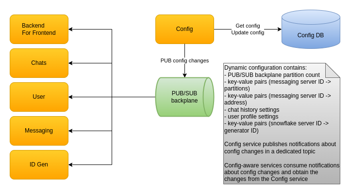

# Configuration

# Static configuration

* Static app configuration is stored in `appsettings.json` files as is typical for .NET applications
* For some services it is overriden for the `Development` environment via the `appsettings.ENVIRONMENT.json` approach
* The [docker-compose files](../deploy/docker) and the [Kubernetes deployments](../deploy/minikube) for the application services use environment variables with specific prefixes in order to push static configuration values to the services at start-up
* [ASP.NET documentation](https://docs.microsoft.com/en-us/aspnet/core/fundamentals/configuration/?view=aspnetcore-5.0#environment-variables) describes how to name the environment variables in order to override both ASP.NET and application-specific values

# Dynamic configuration

Some parts of the configuration are designed to be changed while it is running.

## Seeding

Dynamic configuration is stored in Yugabyte DB which can be seeded manually using scripts for the [docker](../deploy/docker/yugabyte/config.sql) or [minikube](../deploy/minikube/yugabyte/config.sql) deployments, respectively. Alternatively, if there are no values, the Config service seeds the configuration at startup with values depending on the environment the service is configured for.

## Changing

The configuration can be changed manually using the SQL shell inside the container or the pgAdmin tool. But that would not be the correct approach for an environment that has services already running since they will not be notified about the configuration changes. For now, there are Swagger-enabled endpoints to view existing configuration and to update it. Updating it in this way sends notifications to subscribed services and allows for modifying existing elements, adding new ones, deleting existing ones.

## Change notifications

When a configuration update is successful a notification message is sent in a dedicated topic in the Kafka backplane to all services subscribed to configuration changes. The message contains the configuration section which is changed. There are multiple messages if more than 1 configuration section is changed in a single update. The services subscribed to configuration changes can then query the Config service via a gRPC endpoint to obtain all the elements in the updated configuration section, if they are interested in it. 

## Service behavior

Each service that is using dynamic configuration loads, validates and outputs the elements it needs when starting. After being started, if the configuration is changed, the service repeats the process of loading, validating and outputting. If the new configuration values are not valid the service will reject the change. The validation output provides descriptive information which can be used to correct the values.

## Configuration elements usage

Here is a mapping of each service and the configuration elements it uses:

* BFF service - partition count, server partitions, server addresses, user profile settings
* Messaging service - partition count, server partitions
* Chats service - chat history settings
* ID Gen service - snowflake generator IDs
* User service - partition count, server partitions, user profile settings
