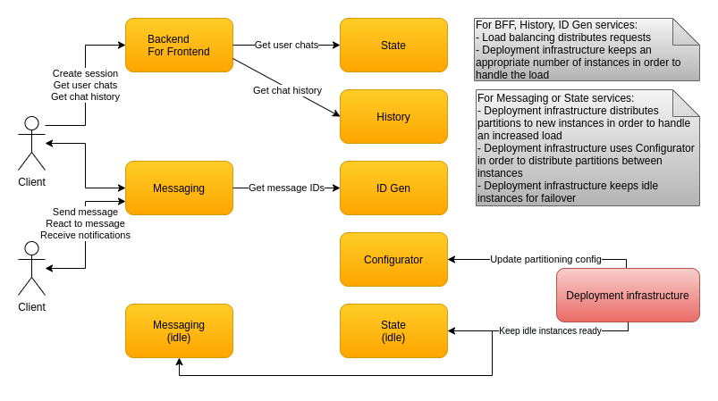

# Deployment

Each Kafka partition is consumed by exactly one messaging server. Once this server is declared dead it should be replaced by a new one. To speed things up the deployment infrastructure should keep idle messaging servers waiting. Idle ones also have server IDs as described in the configuration section. Replacing a dead server then costs:

* Handling the notification from the deployment infrastructure
* Updating the server partitions configuration
* Publishing the configuration change notification
  - This doesn't affect currently alive messaging servers since their configuration doesn't change
  - Only the new messaging server is affected when it starts consuming messages
