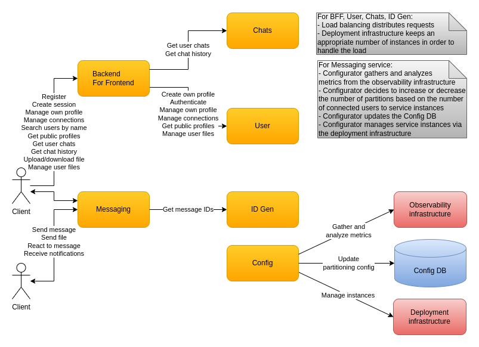

# Deployment

# Load-balancing

* BFF, User, Chats, ID Gen services rely on the Kubernetes provided load balancer
* Messaging service instance is chosen when a session for the user is created

# Auto-scaling conventional services

For BFF, User, Chats, ID Gen services Kubernetes adds/removes instances based on resource utilization with custom rules and the load balancer for each service gets updated.

# Auto-scaling Messaging service

The Messaging service is stateful due to the Kafka partitions which each instance is consuming, so the process is a bit more complex:
* The Config service analyzes the metrics provided by the observability infrastructure.
  - Doing this frequently would lead to smaller changes in the number of instances and related infrastructure.
  - Smaller changes take less time to be materialized and are more optimal in terms of cost.
  - Predicting the load based on past usage can also be utilized to reduce the allocation of unnecessary resources.
* When the Messaging service instances reach an upper/lower threshold of connected users then either new instances need to be added (increase) or existing ones removed (decrease).
  - In an increase the new instances need some of the currently assigned partitions.
  - In a decrease the instances that need to be terminated need their partitions to be assigned to the surviving instances.
* Config service calculates the desired partition distribution among the instances and updates the dynamic configuration in ConfigDB.
  - This process could be optimized in such a way that minimal clients are disconnected and/or other important factors.
* Existing instances are notified for the partition changes.
  - In an increase some of the instances disconnect some of the connected clients.
  - In a decrease the instances to be terminated disconnect all of their connected clients.
* Config service updates the deployment infrastructure and adds required new instances or terminates the unneeded ones.
  - In an increase the new instances start up and begin processing the partitions assigned to them.
  - In a decrease the existing instances begin processing the partitions newly assigned to them.
* New and previously disconnected clients dedicated to the moved partitions now connect.
  - Clients should not be connected to 2 instances simultaneously.
  - The time between disconnect is minimal e.g. P99 1 second, up to 5 seconds max.
  - We can prepare instances beforehand to quicken the transition and possibly use other small optimizations.
  - Client receives a special `DISCONNECT` notification which it can use to make the transition without indicating loss of connection.

Example of partitions distribution increase:
* Partitions are `[0-359]`
* Instances handling those partitions are `0 -> [0-179]`, `1 -> [180-359]`
* When the upper threshold of connected users is met, some partitions should be redistributed to a new instance `2`
* Config service updates ConfigDB with the new distribution `0 -> [0-119]`, `1 -> [180-299]`, `2 -> [120-179, 300-359]`

Example of partitions distribution decrease:
* Partitions are `[0-359]`
* Instances handling those partitions are `0 -> [0-119]`, `1 -> [120-239]`, `2 -> [240-359]`
* When the lower threshold of connected users is met, instance `2` needs to be terminated and its assigned partitions distributed to existing instances `0` and `1`
* Config service updates ConfigDB with the new distribution `0 -> [0-119, 240-299]`, `1 -> [120-239, 300-359]`

The number of partitions can be big. Kafka clusters are known to work with 10 000 or 20 000 partitions. Which means their distribution can be made even among instances with the appropriate number of partitions and instances. Additionally the partitions can be split into smaller partition ranges in order to make it more convenient to create an algorithm for even distribution.

# High-availability

* Kubernetes monitors the instances using the health probes for startup, liveness, readiness
* Kubernetes ensures the appropriate number of instances are up and running
