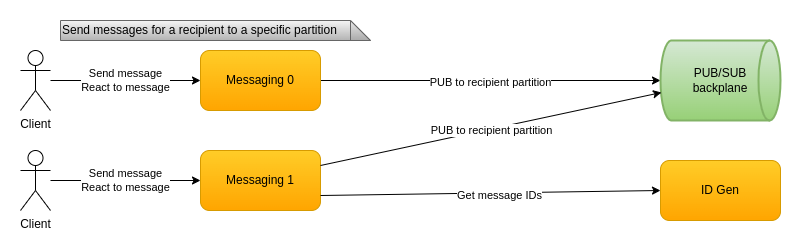
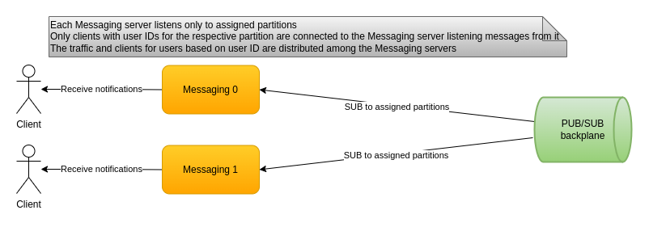

# Messaging

Messaging is the part of the system responsible for the essential data flow - messages between users

# Traffic partitioning

Each messaging server is uniquely assigned part of the messages from the PUB/SUB backplane. We cannot afford **every** messaging server to process **all** messages. Since we're using Kafka that means we split the messages into partitions. Messages for a given user are always in the same partition. The formula is:
```
Recipient Kafka partition = Hash(Recipient ID) % Partition count
```

The hash function from the formula needs to be stable because it would be run on different servers. It needs to provide an **excellent** distribution since we don't want hot partitions. And since this is the same function which is used to decide which messaging server each client connects to - we don't want to hit our messaging server connection number limit. The performance requirements are not key, it just doesn't need to be slow. I used [FNV](https://en.wikipedia.org/wiki/Fowler%E2%80%93Noll%E2%80%93Vo_hash_function) which satisfied the requirements. The code in `Check.sln` checks how it behaves and verifies its total distribution deviation and max one are small enough.

# Send



The Kafka producer doesn't use the default auto-partitioning when sending messages. Instead it is choosing a partition for the sent message manually. It is required since each messaging server is stateful - the clients connected to it are assigned to specific partitions. Fortunately the Kafka .NET client API has these capabilities.

Additionally we use the Kafka delivery handler in order to send the client a positive or negative ACK. It is used by the client to know whether the message has been processed.

# Receive



Each messaging server contains a Kafka consumer which is manually assigned Kafka partitions and consumes messages only from them. Only clients whose hashed user ID value matches the assigned partitions according to the formula connects to that messaging server.

Messages for a client are enqueued in a bounded message queue. That helps limit the memory for each client. If the client is a slow receiver though there is a possibility for the messages to fill the queue up. Which means that some messages would get dropped. Using counters sent along with each message the client can track for gaps and use the chats service in order to get missing messages from the chat history. This is described in detail in [reliable messaging and consistency](research-reliable-messaging-consistency.md).

# Multiple clients

Sometimes a user has multiple clients with the same user ID. Each client should be able to receive messages sent from one of the other clients. From the formula we know that clients for the same user ID are using the same Kafka partition. Therefore they are all connected to the same messaging server. Which means we can asynchronously enqueue the message from the sending client to the other clients.
