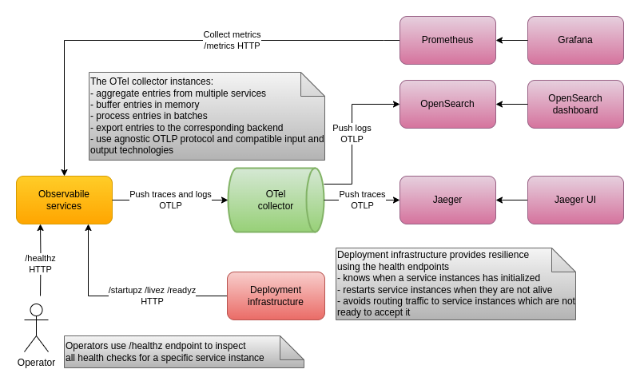

# Observability

## Health

Various health checks are exposed via HTTP health endpoints:

| endpoint    | output   | executed by | purpose                |
|-------------|----------|-------------|------------------------|
| `/healthz`  | detailed | human       | manual troubleshooting |
| `/startupz` | minimal  | Kubernetes  | startup probe          |
| `/livez`    | minimal  | Kubernetes  | liveness probe         |
| `/readyz`   | minimal  | Kubernetes  | readiness probe        |

Note: in Development mode all endpoints use detailed output

* `/healthz`
  - All health checks
* `/startupz`
  - Initialization of databases
  - Starting consumers
* `/livez`
  - Checking if consumers are working
* `/readyz`
  - Healthy connection to
    - Databases
    - Message brokers
    - Downstream services

## Distributed tracing

OpenTelemetry is utilized to make flow of communication and data exchange observable and help resolve production issues.

### Resources

Each service is represented as a separate resource with namespace, name and version.

### Instrumentation

The following instrumentation is used:
* Out-of-the-box
  - ASP.NET Core with support for gRPC server-side
  - gRPC client instrumentation for service-to-service communication
  - Npgsql client instrumentation for YugabyteDB implementing the UserDB used in User service
  - Redis client instrumentation for User cache in User service
* Custom
  - Backplane instrumentation
    - At the level of Kafka producers and consumers
  - HistoryDB and StateDB instrumentation for Cassandra queries
    - At the level of Cassandra but requiring code in the application
  - Messaging instrumentation
    - at the level of SignalR

### Sampling

* During development all traces are sampled
* For Docker and Minikube deployments only a custom percentage of traces are sampled - value is set in the configuration
* The `/metrics` and health endpoints are excluded

### Exporting

* Observable services use Open Telemetry and the agnostic OTLP exporter to send collected traces
* The Open Telemetry OTel collector collects the traces and uses OTLP to push them to Jaeger
* Jaeger stores and provides access to collected traces
  - Currently the Docker image used stores traces in memory
  - For production a full deployment of Jaeger and all its components needs to be implemented

## Log aggregation

* OpenTelemetry, ElasticSearch and Kibana are utilized in the process.
* Applications services send their logs in batches to an OpenTelemetry collectors via OTLP
* The collectors are sending them again in batches to an ElasticSearch backend in a dedicated index
* Kibana is configured to access the ElasticSearch backend and provides ability to view and search logs

## Metrics

Since OpenTelemetry is maturing, its SDK and API for metrics is used with the appropriate exporters. For now this is Prometheus, but in the future InfluxDB or another database could be preferred. 

The following metrics are exported from the servers:
* Protocol level
  - HTTP request duration histogram
  - Cassandra query duration histogram
* Application level
  - Messages
    - Received count
    - Processed count
  - Online clients count

## Monitoring

* Collection
  - OpenTelemetry is used to collect metrics and traces via push/pull methods
  - Prometheus is used to scrape metrics via a `/metrics` endpoint
  - Jaeger is used to collect traces pushed to it
* Visualization
  - Grafana adds data sources for the respective collectors
  - It presents dashboards with panels to visualize the different metrics being provided to it
