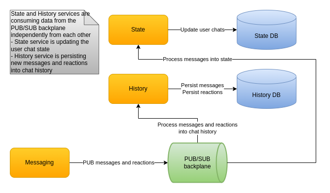

# State and history design

# State

User chats has the following needs:
* Partitioning of user chats based on user ID.
* Fast small writes for the currently active users and the chats they are using. That would happen as the data is materialized from the PUB/SUB backplane.
* Fast query for user chats when a user logs-in.

The user chat state holds the newest message ID, which is timestamped since it is a Snowflake. This way users know if they have a new message for a particular chat. Messages for a given chat come from the PUB/SUB backplane from different Kafka partitions and thus are not guaranteed to be time ordered. So when we update a user chat newest message ID we need to check if it is actually newer. But Cassandra doesn't support updating a record via a WHERE clause for columns other than PARTITIONING KEY and CLUSTERING KEY since it doesn't perform a read before doing a write. One Cassandra-based way to work around this is via lightweight transactions which contact all replicas for the given keyspace. That increases latency and slows down the processing of messages from the PUB/SUB backplane.

As a solution we're using an in-memory LRU cache containing the user chats. That way, updating the user chat newest message ID is done in-memory and the user chat is updated in the database only if needed. Additionally, user chats that are already in memory are not loaded from the database.

# History

Chat history has the following needs:
* Partitioning of chat messages based on chat ID.
* Fast small writes in the most recent part of messages. That would happen as the data is materialized from the PUB/SUB backplane.
* Recent and random range queries of messages for the following use cases:
  - When a user opens a chat
  - When a user reviews a chat back in time
