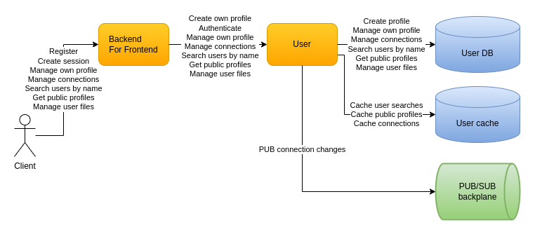

# Users

# Registration and authentication

Usernames are the unique element in terms of registration. They are always lower-case in order to avoid similarly named users. Avoiding phone and/or emails for this allows the users to change them easily.

Passwords are hashed:
* Using the [PBKDF2 key derivation function](https://en.wikipedia.org/wiki/PBKDF2)
* Using the [SHA-512 hash function](https://en.wikipedia.org/wiki/SHA-2)
* Doing 1 000 000 iterations 
* Using a 16-byte cryptographically strong salt
* Creating a 16-byte password hash
* The specific algorithms and/or numbers could be evolved which is supported by a version token stored alongside the salt and the password hash
* Another improvement would be to use pepper which would make the solution too complicated for now

When creating a session each user is provided:
* A client ID which is used to distinguish between the same user logged in different clients (e.g. mobile and browser)
* A JWT access token containing the necessary claims (e.g. user ID, user name, client ID, role) and an appropriate expiration
* The user full profile in order to allow managing it
* The address of the messaging server to use in order to send messages, react etc.

# Own profile

The profile gets created during registration and is returned when creating a new session. Profile management includes:
* Changing the password
* Editing the trivial properties (e.g. display name)
* Support for changing avatar would be added when uploading an avatar image gets implemented
* Support for changing the phone and the email would require confirmation and would be added subsequently

The issue of lost updates is considered in the implementation. This occurs when the same user authenticates from 2 different clients and tries to concurrently update his/hers profile. Optimistic concurrency is applied using a separate version column, a date-time value which gets updated on each profile change.

# User search

Searching for users by name supports specifying a desired part of the user name, such as `mar`, which would return all public profiles for user with user names like `maria`, `martin`, `marvel` etc. The implementation relies on PostgreSQL full-text search capabilities implemented with `pg_trgm` extension which creates and updates an index using trigrams. Such an index supports not just prefixes and suffixes but SQL queries `LIKE '%mar%'` with good performance. In order to avoid overloading the database a minimum pattern length of 3 is required and search results are cached as well. The number of public profiles returned is limited to a value from the dynamic configuration in order to avoid returning an excessive amount of data when common names match the pattern.

# Public profiles

Public profiles are obtained by the clients when opening all chats and a single chat. Since the public profile data doesn't change frequently, calling the User database is avoided if the requested public profiles are already in a User cache. This reduces latency and also reduces the load on the User database. The profile entries are added for a certain amount of time, after which they expire.

# Connections

Connections are obtained by the clients when opening all chats and a single chat. Since connection data doesn't change frequently, calling the User database is avoided if the user connections are already in a User cache. This reduces latency and also the load on the User database. The connections for a user are added for a certain amount of time, after which they expire.

Connections can be created and managed using the following actions - invite/accept/cancel/remove. For each valid and successful action there is a notification for the initiating and targeted users for all their connected clients. Cache is not updated so if a notification is lost the connection data cached would not be up-to-date. Considering the reduced usage of this feature and the low likelihood for a notification to get lost, that's an acceptable compromise for now.

# User files

User files are uploaded to and downloaded from a dedicated file storage. They cannot be edited and are immutable. File limitations enforced include size of up to 512KB. File download access is controlled by dedicated object tags - `users` which includes user IDs and `groups` which includes group names. Files are stored in separate buckets for each day. Within each bucket there is a folder for the specific user. This allows for grouping files primarily by time, not by user, resulting into more predictable bucket sizes.

The user-file association is stored in a dedicated table in the User DB. It stores the bucket name and path which link to the file storage. Associations are queried using a timestamp - all user files newer than a specific date. Since associations are immutable and because of the ability to query them via a timestamp, dedicated cache is not needed. Clients initially load the full list of files for the current user and subsequently request only the newer ones.
