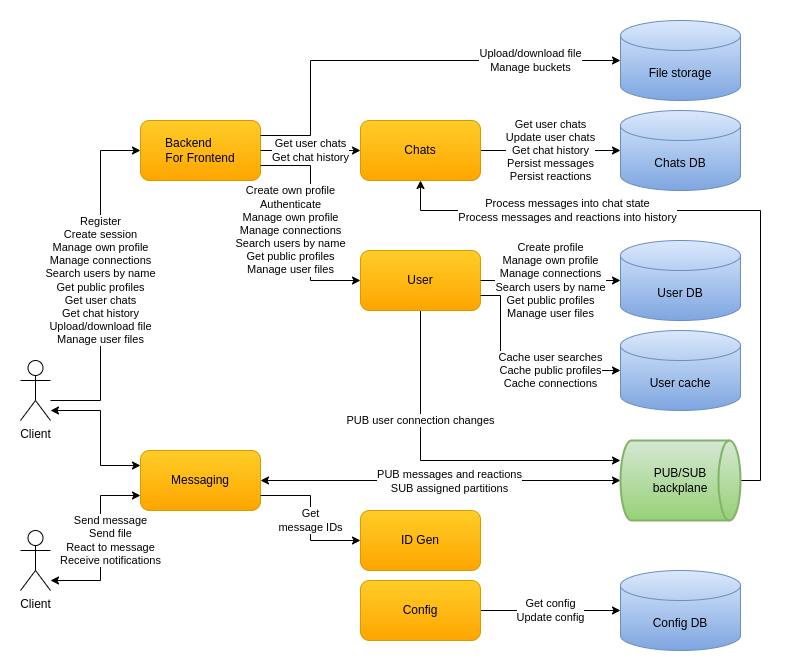

# Overall design

* Clients use the User service via the BFF to:
  - Register and manage their profile
  - Authenticate and create their session
  - Acquire other users public profiles
  - Search other users by name
  - Manage their connections - invite/accept/cancel/remove
  - Get the list of their files
* Clients use the File storage via the BFF to:
  - Upload/download their files
  - Download files sent to them
* Clients use the Chats service via the BFF to:
  - Acquire the state of their chats
  - Get chat history at a random point in time
* Clients connect to Messaging service in order to chat with each other
* Messaging service instances exchange data between each other indirectly using a PUB/SUB backplane
* PUB/SUB backplane distributes the traffic between Messaging service instances
* ID Gen service is used to generate Snowflake message IDs
* Chats service transforms the messages and reactions from the PUB/SUB backplane into the Chats database:
  - As the user chat state which is the source of truth 
  - As the chat history which is the source of truth

Development and operations:

* Splitting the different responsibilities between separate services enables independent development, testing, versioning, deployment, scaling
* The dynamic configuration is updated centrally and interested services are notified about selected changes
* Observability is achieved via health checks, distributed tracing, log aggregation and metrics with monitoring
* Deployment infrastructure takes care of automation, load balancing, auto-scaling

More details on the design of each aspect:

* [Messaging](design-messaging.md)
* [Chats](design-chats.md)
* [User - profiles, connections, files](design-users.md)
* [Clients](design-clients.md)
* [Configuration - static and dynamic](design-configuration.md)
* [Observability](design-observability.md)
* [Deployment](design-deployment.md)

All the diagrams are in the [diagrams](diagrams) folder and [draw.io](https://app.diagrams.net/) is needed in order to view them. From the `Help` item in the menu a desktop tool could be downloaded, if preferred. Currently this is the [link with the releases](https://github.com/jgraph/drawio-desktop/releases).
