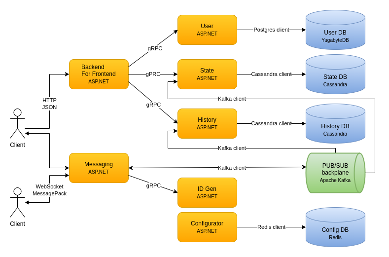

# Technologies

The technologies chosen are [cloud agnostic](https://codersociety.com/blog/articles/cloud-agnostic) which makes the solution independent from a specific cloud provider.

* Integration - Kafka, gRPC, WebSocket, HTTP
* Data storage - Yugabyte, Cassandra, Redis
* Operations - OpenTelemetry, Docker, Kubernetes
* Services - .NET, ASP.NET, SignalR, EF Core

# Client communication

* Clients use WebSocket transport with MessagePack message format to communicate with the Messaging service
* Clients use HTTP transport with JSON message format to communicate with the BFF service

# Service synchronous communication

Services communicate synchronously with each other via gRPC:
* open-source software backed by Google
* supports multiple languages
* lightweight and has good performance
* based on HTTP/2 which allows for both inter-operability and optimizations from the protocol

# Service asynchronous communication

Services communicate asynchronously via the PUB/SUB backplane which is based on Kafka:
* open-source software backed by Confluent
* a linearly scalable message broker
* enables a superb throughput due to its balanced distribution of partition leadership throughout the cluster
* fault-tolerant and persists messages with customizable durability
* can be tuned for either low latency, high-throughput or something in-between
* allows different consumer groups each of which can process messages independently from each other
* has a pull model which allows consumers to process messages at their own rate
* a good solution for an event log, especially when processing a single message is fast
* has some known operability issues with partition redistribution among a consumer group
* relies on ZooKeeper as an additional element in the infrastructure

# User database

User database is based on Yugabyte DB

* distributed SQL database
* based on Postgres and driver-compatible with it
* highly-available with built-in data replication and follower reads
* horizontally scalable
* supports partitioning (sharding) by hash or range
* handles distributed transactions in a scalable and resilient way with optimistic concurrency
* supports traditional SQL indexes and constraints
* has different multi-region deployment modes
* supports change data capture (CDC)
* observable with integration for popular existing technologies

# User cache

User cache is based on Redis:
* open-source software
* lightweight and performant
* easy to use and manage

# State and History databases

State and history are based on Cassandra:
* open-source software backed by DataStax
* linearly scalable
* distributed with auto-partitioning and auto-replication
* supports multi data-center auto-replication
* suitable for random small fast writes and reads
* suitable for random range queries
* suitable for time series
* eliminates the need of caching
* allows precise control over the consistency used for writes and reads
* ensures data consistency via hinted handoffs and read repairs
* needs regular anti-entropy repairs which are CPU-bound

# Configuration database

Configuration is based on Redis:
* open-source software
* lightweight and performant
* easy to use and manage
* has a built-in PUB/SUB mechanism
* should be replaced by a more reliable technology in the future, e.g. a relational DB for storage and Kafka for notifications

# Observability

* Distributed tracing is based on OpenTelemetry and Jaeger is configured for viewing traces and spans
* Metrics and monitoring is based on OpenTelemetry, Prometheus and Grafana
* Log aggregation is based on OpenTelemetry, ElasticSearch and Kibana

# Deployment

* Containerization relies on Docker for its maturity, popularity, tooling and integration
* Orchestration is based on Kubernetes and Helm for its power, maturity, popularity, tooling
* infrastructure as code - TBD, probably Terraform

# Services

The services are based on .NET 6, ASP.NET, SignalR and Entity Framework Core:
* open-source software backed by Microsoft
* very mature, feature-rich, lots of tools
* widely-used with a big community
* well supported

Additional libraries which are all open-source and created, supported and developed by the community:
* Autofac is the most popular DI container
* Serilog is one of the most popular logging frameworks
* AutoMapper is the most popular mapping library
* FluentValidation is the most popular data validation library
* Polly is a popular HTTP client policies library
* Refit is one of the most popular REST clients

# Tools

* Ubuntu is an excellent choice for power users doing development
* Git is a non-negotiable VCS for development at the time of writing
* JetBrains Rider is the second most used .NET IDE
* Minikube is one of the most popular Kubernetes local clusters
